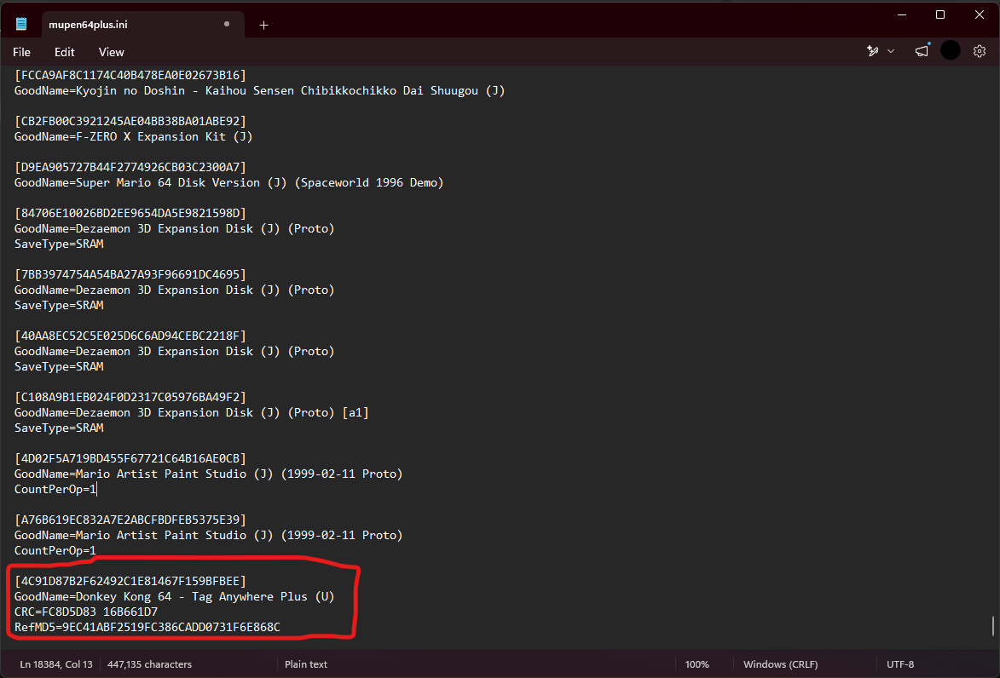

# Donkey Kong 64 - Tag Anywhere Plus

## Table of Contents
- [Social Media Links and Tutorials](#social-media-links-and-tutorials)
- [Attribution](#attribution)
- [Description](#description)
- [Features](#features)
- [Compatibility and Bugs](#compatibility-and-bugs)
- [Setup](#setup)
- [Migration](#migration)
- [License](#license)

## Social Media Links and Tutorials

Here you can find links to my YouTube page where I will post trailers and tutorials related to **Tag Anywhere Plus**.

- ### [Download a Release](https://github.com/TLRomHacks/tag-anywhere-plus/releases)
- ### [v1.0.0 Launch Trailer](https://www.youtube.com/watch?v=FFfOxoElUGU)
- ### [Tag Anywhere Plus - Setup Tutorials](https://www.youtube.com/watch?v=6DwItRqeBDE&list=PLLJLxY1wMZcc)
- ### [Tag Anywhere Plus - Feature Deep Dives Playlist](https://www.youtube.com/watch?v=S0UusFJ8IG8&list=PLAa4xh6dND8w)
- ### [YouTube - TLRomhacks](https://www.youtube.com/@TLRomhacks)
- ### [Reddit - TLRomhacks](https://www.reddit.com/user/TLRomhacks/)

## Attribution

- **Tag Anywhere Plus** is a heavily modified fork and expanded continuation of [Isotarge’s original DK64 Tag Anywhere project](https://github.com/Isotarge/dk64-tag-anywhere). The name is intended to preserve the lineage of the original work while distinguishing this version’s additional features, fixes, customization options, and broader gameplay changes.

## Description

**Tag Anywhere Plus** is a romhack for Donkey Kong 64 built around the spirit of player choice and quality of life improvements. This romhack includes 45+ customization options all aimed at giving players precise control over a new experience! Above all else, my goal is for people to have fun, and to look fondly on a game that means a great deal to me personally.

No ROMs or copyrighted game assets are included in this repository. This project is distributed as a patch intended for use with legally obtained ROMs of Donkey Kong 64.

## Features

- **Tag Anywhere**: Swap between unlocked Kongs at the press of a button; no more need to backtrack to a tag barrel.
- **Fun Fixes**: Several configurable quality-of-life changes aimed at reducing frustration with some of the game's notoriously difficult golden bananas/mechanics, including fixes to Beaver Bother, both beetle races, the flight race with the owl, and more.
- **Bonus Stage Selection**: A new feature found in the settings menu that lets you choose which bonus stage you'll play when entering a bonus stage barrel. You'll even have the ability to choose the difficulty of the bonus stage and modify the time you're given to beat the mini-game.
- **Gimmick Switch**: Found as an option in the mod menu (on by default), 'Gimmick Switch' is a quality-of-life feature around changing the state of gimmicks/mechanics in 3 of the game's worlds. With the Gimmick Switch option turned on and while in the related world, pause the game and press D-Left or D-Right to change the state of a gimmick.
  - Gloomy Galleon: Change the water level of the world between high tide and low tide. Eliminates backtracking to the lighthouse.
  - Fungi Forest: Change between day or night. Eliminates backtracking to the central cuckoo clock.
  - Crystal Caves: Enable or disable the falling stalactites. Eliminates a rather controversial world mechanic.
- **New Skins**: Hidden throughout the world are new DK coin collectibles that unlock new skins for Kongs. Press D-Down on the adventure mode pause screen to open a menu for tracking DK coin collectibles and applying unlocked skins. The latest release includes unlockable skins found in the following worlds with more to come in future releases:
  - Tutorial Area/DK Isles
  - SECRET... I wonder how it's unlocked?
- **Ammo Type Swapping**: Actively swap between normal ammo and homing ammo by pressing D-Down once homing ammo is unlocked by any means.
- **Mod Menu**: A new screen that hosts all configuration options and can be modified at any time by pressing D-Up on the save file load or pause menu screens.
- **Cheats Menu**: Play your way with all original cheats unlocked from the start as well as new additions. Be sure to check out the new **Warp Menu** cheat, accessed through the mod menu during the adventure mode pause menu screen.
- **SFX and Music Test**: New menus that let you listen to SFX and music, accessed through the mod menu during the save file load screen.

## Compatibility and Bugs

This romhack was exclusively built and tested with [RetroArch](https://www.retroarch.com/?page=platforms) + the Mupen64Plus-Next core. The game did receive some light playtesting on Project64 and is most likely compatible with other emulators/flash carts; however, these have and will remain untested. I highly advise you use RetroArch and Mupen for the best possible experience.

Please feel free to report bugs in the [issues tab](https://github.com/TLRomHacks/tag-anywhere-plus/issues) of the release repo. **Tag Anywhere Plus** is a passion project of a solo-dev; thank you for understanding how that may impact response times to feature requests or bug reports.

## Setup

I heavily encourage you watch my video tutorials found on [YouTube](https://www.youtube.com/watch?v=6DwItRqeBDE&list=PLLJLxY1wMZcc) for a better breakdown of the two major things needed to play **Tag Anywhere Plus**. If you're technically savvy and feel you might not need the tutorials, read on for a brief high-level callout of two pieces of setup that need to occur to play optimally.

- 1. Patch your legally obtained ROM of Donkey Kong 64 (`SHA1: cf806ff2603640a748fca5026ded28802f1f4a50`) with the latest **Tag Anywhere Plus** patch using either the provided third-party patching software (included in release downloads), or a patcher of your choice.
- 2. Register **Tag Anywhere Plus** as a database entry in either Mupen's or your emulator's .ini that contains entries of a given game's MD5, 'good name', and CRC. Each release will come with a **save-registration.txt** containing the correct text blob you need to copy/paste into your emulator's .ini. Doing this correctly ensures save data persists between play sessions and is a product of DK64 using a 16 KB EEPROM save format. Failure to include the correct text blob in its corresponding .ini or failure to use save states will result in save data being lost between play sessions.

For Retroarch + Mupen, this .ini is typically found in **...\RetroArch\system\Mupen64plus\mupen64plus.ini** and an example registration would look similar to this (use the values provided in your given release's save-registration.txt file):

## Migration

At this time, **Tag Anywhere Plus** only has one major release. As more releases/hotfix releases are made, this section will explain what, if any, steps need to be taken to migrate save data from an older version of **Tag Anywhere Plus** to a newer one. I will also likely upload a tutorial on [YouTube](https://www.youtube.com/@TLRomhacks) related to this.

### License

- **Tag Anywhere Plus** is distributed for free personal, non-commercial use with legally obtained ROMs of Donkey Kong 64.
- The **Tag Anywhere Plus** patch, documentation, release materials, and project assets are covered by this repository’s custom license. See LICENSE.md.
- Third-party tools included for convenience, such as patching utilities, are licensed separately under their original licenses. See THIRD_PARTY_NOTICES.md.
